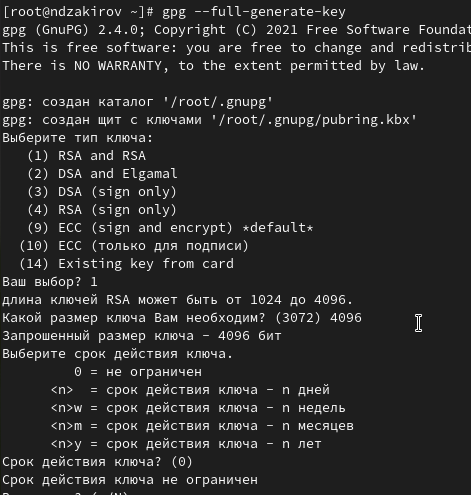

---
## Front matter
lang: ru-RU
title: Лабораторная работа №2
subtitle: Операционные системы
author:
  - Закиров Н.Д., НКАбд-03-23
institute:
  - Российский университет дружбы народов, Москва, Россия
date: 26 февраля 2024

## i18n babel
babel-lang: russian
babel-otherlangs: english

## Formatting pdf
toc: false
toc-title: Содержание
slide_level: 2
aspectratio: 169
section-titles: true
theme: metropolis
header-includes:
 - \metroset{progressbar=frametitle,sectionpage=progressbar,numbering=fraction}
 - '\makeatletter'
 - '\beamer@ignorenonframefalse'
 - '\makeatother'
## Fonts
mainfont: PT Serif
romanfont: PT Serif
sansfont: PT Sans
monofont: PT Mono
mainfontoptions: Ligatures=TeX
romanfontoptions: Ligatures=TeX
sansfontoptions: Ligatures=TeX,Scale=MatchLowercase
monofontoptions: Scale=MatchLowercase,Scale=0.9
---

# Информация

## Докладчик

:::::::::::::: {.columns align=center}
::: {.column width="70%"}

  * Закиров Нурислам Дамирович
  * Студент 1 курса
  * Группа: НКАбд-03-23
  * Российский университет дружбы народов
 
:::
::::::::::::::

# Лабораторная работа

## Цель работы

Целью данной лаболаторной работы является изучение идеологии и применение средств контроля версий и приобретение знаний по работе с git.

# Задание

- Заргеистрироваться на GitHub
- Создать базовую конфигурацию для работы с git
- Создать ключ SSH
- Создать ключ GPG
- Настроить подписи Git
- Создать локальный каталог для выполнения заданий по предмету.

## Установка программного обеспечения

Заранее регистрация в git уже была успешно выполнена, поэтому сразу переходим к следующим этапам. Устанавливаем git при помощи dnf install git и устанавливаем gh при помощи dnf install gh(рис. 1).

{#fig:001 width=50%}

## Базовая настройка git

Далее настраиваем верификацию и подписание коммитов git, зададаем имя начальной ветки master, параметр autocrlf и safecrlf(рис. 2).

{#fig:002 width=60%}

## Создание ключа SSH

Создаем ключ ssh по алгоритму rsa с ключём размером 4096 бит и по алгоритму ed25519 (рис. 3).

{#fig:003 width=50%}

## Создание ключа GPG

Следующим этапом мы генерируем ключ pgp выбирая слудеющие опции:тип RSA and RSA, размер 4096, срок действия неограниченный (рис. 4).

{#fig:004 width=50%}

## Создание ключа GPG

После чего, мы копируем данный нам ключ командой gpg --armor --export <PGP Fingerprint> | xclip -sel clip в буфер обмена, где вместо "PGP Fingerprint" вставляем данные занчения.(рис. 5).

{#fig:005 width=65%}

## Создание ключа GPG

Теперь вставляем данный ключ при помощи комбинации Ctrl+V на официальном сайте GitHub в настройках GitHub, нажав на кнопку New GPG key(рис. 6).

{#fig:006 width=60%}

## Создание ключа GPG

Ключ успешно привязался(рис. 7).

{#fig:007 width=60%}

## Настройка подписи Git

Cледующим этапом мы используем введёный email и указываем Git применять его при подписи коммитов (рис. 8).

{#fig:008 width=65%}

## Настройка gh

Даллее мы авторизируемся в терминале через команду gh auth login. Отвечаем на все наводящие вопросы(рис. 9).

{#fig:009 width=45%}

## Настройка gh

После входим в свой аккаунт GitHub через браузер(рис. 10).

{#fig:010 width=55%}

## Настройка gh

После авторизации, Git просит ввести код, который мы заранее скопировали с терминала и вставили бразуре, после чего мы успешно авторизовались(рис. 11).

{#fig:011 width=55%}

## Настройка gh

В терминале также подтвержается наша авторизация(рис. 12).

{#fig:012 width=65%}

## Создание шаблона для рабочего пространства

Далее нам необходимо создать шаблон рабочего пространства. При промощи mkdir -p ~/work/study/2023-2024/"Операционные системы" мы создаем каталог, после чего переходим в нее. Создаем шаблон при помощи gh repo create(рис. 13).

{#fig:013 width=60%}

## Создание шаблона для рабочего пространства

После чего мы клониуем репозиторий курса на нашу систему при помощи git clone(рис. 14).

{#fig:014 width=60%}

## Настройка каталога курса

Переходим в созданную папку os-intro при помощи cd(рис. 15).

{#fig:015 width=70%}

## Настройка каталога курса

Удаляем лишние файлы при помощи rm (рис. 16).

{#fig:016 width=70%}

## Настройка каталога курса

Создаем необходимые каталоги при помощи echo и make(рис. 17).

{#fig:017 width=55%}

## Настройка каталога курса

Отправляем файлы на сервер GitHub при помощи git add, git commit и git push(рис. 18).

{#fig:018 width=50%}

## Вывод

В ходе данной лаболаторной работы я изучил идеологии и применения средств контроля версий, а также приобрел знания по работе с git.

# Список литературы{.unnumbered}

1. Лабораторная работа № 2 [Электронный ресурс] URL: https://esystem.rudn.ru/mod/page/view.php?id=970819

